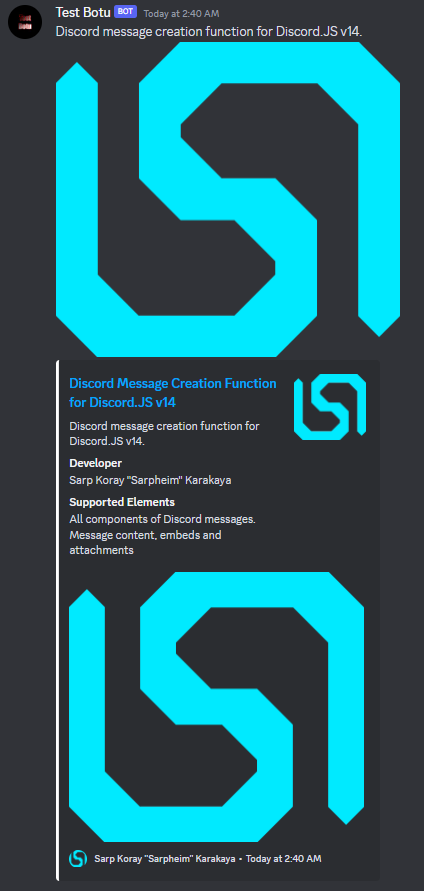

# discord-message-creation-function
Discord message creation function for Discord.JS v14.

---

## Usage
```javascript
const DiscordMessageCreationFunction = require("./discord-message-creation-function.js")
const Discord = require("discord.js")
const message = message
const channel = message.channel || user
const content = "Discord message creation function for Discord.JS v14."
const embed = new Discord.EmbedBuilder()
embed.setColor("#FFFFFF")
embed.setThumbnail("https://www.sarpheim.xyz/public/images/Sarpheim_Logo_Anasayfa.png")
embed.setTitle("Discord Message Creation Function for Discord.JS v14")
embed.setDescription("Discord message creation function for Discord.JS v14.")
embed.addFields([
  {
    name: "Developer",
    value: "Sarp Koray \"Sarpheim\" Karakaya",
    inline: false
  },
  {
    name: "Supported Elements",
    value: "All components of Discord messages.\nMessage content, embeds and attachments",
    inline: false
  }
])
embed.setImage("https://www.sarpheim.xyz/public/images/Sarpheim_Logo_Anasayfa.png")
embed.setFooter({
  text: "Sarp Koray \"Sarpheim\" Karakaya",
  iconURL: "https://www.sarpheim.xyz/public/images/Sarpheim_Logo_Anasayfa.png"
})
embed.setTimestamp()
embed.setURL("https://www.sarpheim.xyz")
const embeds = [
  embed
]
const attachment = new Discord.AttachmentBuilder("https://www.sarpheim.xyz/public/images/Sarpheim_Logo_Anasayfa.png", {
  name: "Sarpheim_Logo.png"
})
const files = [
  attachment
]

DiscordMessageCreationFunction({
  Discord: Discord,
  message: message,
  channel: channel,
  content: content,
  embeds: embeds,
  files: files
})
```

---

## Result
```
[](#)
```
